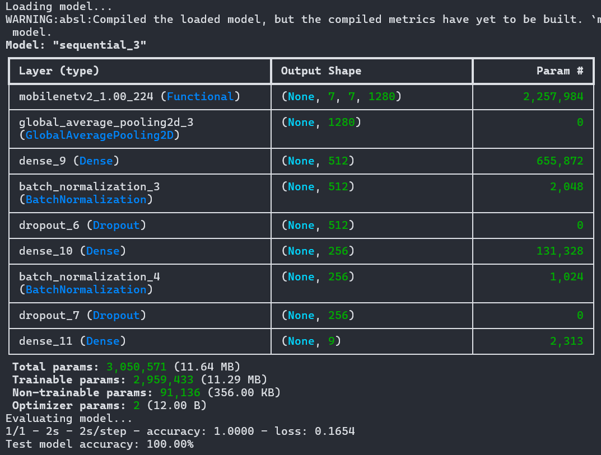

# Transfer Learning for Mushroom Classification

This project implements a transfer learning approach using TensorFlow to classify mushroom images into nine distinct classes.

## 📁 Directory Structure

- `proj2.py`: Training script for the model.
- `proj2_test.py`: Script to evaluate the trained model.
- `my_model.h5`: Saved trained model.
- `requirements.txt`: Python dependencies.
- `report.pdf`: Detailed project report.

---

## 🛠️ Setup Instructions

1. **Create and activate a virtual environment** (optional but recommended):

   ```bash
   python -m venv tf_env
   source tf_env/bin/activate  # On Windows: tf_env\Scripts\activate
   ```

2. **Install dependencies**:

   ```bash
   pip install -r requirements.txt
   ```

3. **Ensure data is in the right format**:
   - Place your training data inside `Mushrooms/`, organized by class subfolders (one folder per class).
   - Place your testing data inside `sample_mushroom_data/`.
   - Place the test CSV and images as specified in `proj2_test.py`.

---

## 🚀 Running the Code

### ✅ To train the model:

```bash
python proj2.py
```

- This will preprocess the data, apply data augmentation, fine-tune a MobileNetV2 model, and save the final model to disk as `my_model_X.h5`.

### ✅ To test the model:

```bash
python proj2_test.py
```

## 📈 Model Evaluation

Below is the model's performance on the test set after fine-tuning:



- Make sure to adjust the `model_path` and `test_csv_path` variables inside `proj2_test.py` if needed.
